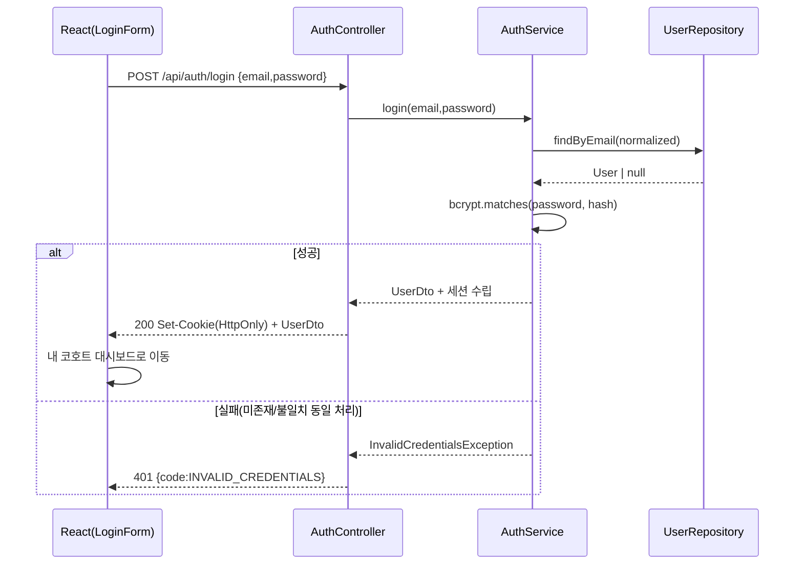

# Business Logic Model — U1 foundation (LearnKK 파일럿)

> Construction · functional-design 단계 산출물 · 유닛 U1-foundation
> 리드 architect (서포트 developer 기술 타당성)
> 상위 입력: `units-generation/unit-of-work.md`(U1 책임·스토리), `unit-of-work-story-map.md`(US-0/1/2 매핑), `requirements-analysis/requirements.md`(FR-1, NFR-1/5/7), `application-design/components.md`(레이어·User), `component-methods.md`(AuthService.signup/login), `services.md`(AuthService·FileStorageService·시드)
> 범위: 실행 가능한 최소 앱 골격 + 인증. 워킹 스켈레톤(Bolt 1)의 end-to-end 관통 대상.

## 1. U1 책임 요약 (workflows 목록)

`unit-of-work.md`의 U1 정의에 따라 본 유닛은 아래 워크플로/골격을 구현한다.

| # | 워크플로 | 스토리 | 산출 로직 |
|---|---|---|---|
| W1 | 저장소·앱 스캐폴딩 | (인프라) | FE(React)/BE(Spring) 분리 저장소 골격, 헬스체크 |
| W2 | 공통 에러 처리 | (인프라) | `@RestControllerAdvice` + 공통 에러 DTO |
| W3 | 보안·인증 골격 | US-0 | Spring Security 필터체인, BCrypt 인코더, 권한 규칙 |
| W4 | 회원가입 | US-1 | AuthService.signup |
| W5 | 로그인 | US-2 | AuthService.login + 세션 수립 |
| W6 | RBAC 관리자 시드 | US-0 | Flyway 마이그레이션 시드(멱등) |
| W7 | 파일 저장 골격 | (인프라) | FileStorageService(제약 검증, 웹루트 밖 저장) |
| W8 | API 문서 | (인프라) | springdoc-openapi 셋업, permitAll |

## 2. W4 회원가입 알고리즘 (AuthService.signup)

`component-methods.md`의 `signup(email, name, nickname, password): UserDto`를 구체화한다.

절차:
1. 입력 검증(business-rules R-U1-01~04, R-U1-07): email 형식, name/nickname 길이, password 최소 길이. 위반 시 도메인 검증 예외 → 400.
2. email 소문자 정규화(R-U1-02) 후 중복 조회. 존재 시 `DuplicateEmailException` → 409 DUPLICATE_EMAIL. 사전 조회를 통과한 동시 삽입 경쟁은 UNIQUE 제약 위반(`DataIntegrityViolationException`, R-U1-17c)으로 다시 DUPLICATE_EMAIL 매핑(경쟁 안전).
3. `passwordHash = bcrypt.encode(password)` (R-U1-05).
4. isAdmin=false 고정(R-U1-06)으로 User 저장.
5. 응답 DTO(UserDto: id·email·name·nickname·isAdmin) 반환. passwordHash 미포함(INV-1).

결정 트리(중복·검증):
```
signup(req)
  ├─ 형식/길이 위반? ─ yes ─> 400 VALIDATION_ERROR
  ├─ email(정규화) 이미 존재? ─ yes ─> 409 DUPLICATE_EMAIL
  └─ 정상 ─> BCrypt 해싱 -> 저장(isAdmin=false) -> 201 + UserDto
```
<!-- Text fallback: signup은 형식 위반 시 400, 중복 email이면 409, 정상이면 BCrypt 해싱 후 isAdmin=false로 저장하고 201과 UserDto 반환. -->

동시 가입 경쟁: email UNIQUE 제약이 최종 방어선. 애플리케이션 사전 조회가 통과해도 저장 시 제약 위반이면 DUPLICATE_EMAIL로 매핑(경쟁 안전).

## 3. W5 로그인 알고리즘 (AuthService.login)

**계약 정합(component-methods.md 시그니처 해석)**: `component-methods.md`의 `login(email, password): AuthToken`에서 `AuthToken`은 파일럿에서 **서버 세션으로 실체화**되는 값 개념이다. 즉, 서비스는 인증 성공 시 HttpOnly 세션 쿠키를 발급하여 인증 상태를 수립하고, HTTP 응답 본문으로는 `UserDto`를 반환한다. 별도의 무상태 JWT 토큰 문자열은 발급하지 않는다(도메인은 세션/토큰을 영속 엔티티로 두지 않음 — domain-entities.md §5). 확장 시 `AuthToken`을 무상태 JWT DTO로 재해석할 수 있으며, 그 경우에도 이 절의 흐름(검증→인증수립→UserDto)은 유지된다. 이로써 상위 계약(component-methods)과 본 설계의 표현 차이를 해소한다.

절차:
1. email 정규화 후 사용자 조회.
2. 미존재 또는 `bcrypt.matches` 실패 → **동일** `InvalidCredentialsException`(R-U1-09, 사용자 열거 방지) → 401.
3. 성공 → 인증 컨텍스트 수립, HttpOnly·SameSite 세션 쿠키 발급(R-U1-10).
4. 응답 UserDto 반환. FE는 "내 코호트 대시보드"로 이동(R-U1-11).

시퀀스:

<!-- Text fallback: LoginForm이 email/password를 AuthController에 POST하면 AuthService가 사용자 조회 후 BCrypt matches로 검증한다. 성공 시 세션 쿠키와 UserDto(200), 실패 시 미존재·불일치 모두 동일한 401 INVALID_CREDENTIALS를 반환한다. -->

## 4. W3 보안 필터/인가 규칙 흐름 (US-0)

Spring Security 필터체인 구성 규칙(business-rules R-U1-12~16):
- permitAll: `/api/auth/**`(가입·로그인), springdoc(`/v3/api-docs/**`, `/swagger-ui/**`), 헬스체크.
- authenticated: 그 외 전 경로(세션 필요).
- 권한 매핑: 인증 사용자 → ROLE_USER; `isAdmin==true` → ROLE_ADMIN 추가.
- **관리자 경로 인가 메커니즘(R-U1-16a)**: U1의 필터체인은 **역할 매핑만** 확립하고 관리자 경로를 URL로 열거하지 않는다. 관리자 인가는 **메서드 레벨 애너테이션** `@PreAuthorize("hasRole('ADMIN')")`로 강제하며, 후속 유닛(U3/U6)은 자신의 컨트롤러 메서드에 애너테이션을 붙이는 것만으로 인가가 걸린다. 따라서 U1은 동적 경로 등록 목록을 관리하지 않으며 U3/U6과 필터 설정 충돌이 발생하지 않는다.

## 5. W6 RBAC 관리자 시드 흐름 (Flyway)

`services.md` 시드 절 + `cid:application-design:c1` (규칙: business-rules R-U1-25~27):
1. Flyway 마이그레이션이 스키마 생성 후 시드 단계 실행.
2. 멱등 판정 쿼리 `SELECT 1 FROM users WHERE email = :adminEmail LIMIT 1` 실행. 존재 시 no-op(R-U1-25).
3. 미존재 시: 환경변수에서 초기 비밀번호 주입 → BCrypt 해싱 → `isAdmin=true` User 삽입(R-U1-26).
4. 환경변수(관리자 email·비밀번호) 미설정 시 조용히 스킵하지 않고 명시적 실패로 부팅 중단(R-U1-27). 평문 비밀번호를 마이그레이션 파일에 커밋하지 않는다.

```
migrate()
  └─ afterSchema:
       ├─ exists(admin email)? ─ yes ─> no-op(멱등)
       └─ no ─> bcrypt(env password) -> insert User(isAdmin=true)
```
<!-- Text fallback: Flyway 시드는 관리자 email이 이미 있으면 아무것도 하지 않고(멱등), 없으면 환경변수 비밀번호를 BCrypt 해싱해 isAdmin=true 계정을 삽입한다. -->

## 6. W2 공통 에러 처리 흐름

- 서비스는 도메인 예외를 던지고 `@RestControllerAdvice`가 잡아 공통 에러 DTO(`code,message,timestamp,path`)로 변환(R-U1-17~20).
- **완전한 예외→HTTP 매핑 표**는 business-rules.md §4.1(R-U1-17a~17i)에 정의: 검증→400, DuplicateEmail/UNIQUE위반(23505)→409, 인증실패→401, 미인증→401, 권한없음→403, 미존재→404, 파일제약→400, 그 외→500(내부 상세 비노출, R-U1-19). U1이 공통 핸들러를 확립하므로 U1 범위 예외를 빠짐없이 등록한다.

## 7. W7 파일 저장 골격 (FileStorageService)

`component-methods.md`의 `store(file, constraints): storedPath` / `load(path): Resource` + 보상 삭제 `delete(path): void`:
1. MIME·크기·확장자 검증(R-U1-22~23). 위반 → FILE_CONSTRAINT_VIOLATION.
2. 서버 생성 UUID 파일명으로 웹루트 밖 볼륨에 저장(R-U1-21, R-U1-24). 저장 경로(메타)만 반환.
3. load는 저장 경로 유효성 확인 후 Resource 스트림 반환(경로 이탈 방지).
4. **`delete(path)`**: 저장 파일을 삭제한다(경로 이탈 방지 후). 상위 유닛의 트랜잭션 롤백 보상(예: U4 uploadEvidence 롤백 시 고아 파일 제거)에 사용. 대상 파일이 없으면 no-op(멱등). 삭제 실패는 예외를 던지되 호출측이 로깅 후 진행하도록 허용.

U1은 서비스 계약·검증만 확립하며 업로드 사용처(증빙 U4, 보고서/증서 U5)는 후속 유닛에서 호출한다. `delete`는 U4/U5의 파일+DB 결합 트랜잭션 보상을 위해 U1이 제공한다.

## 8. 프론트엔드 연동 (auth UI)

U1 유닛은 `unit-of-work.md` 정의상 kind=service이나 **"배포 실행체 백엔드 + 해당 UI 포함"**이며, 인증 UI(로그인/가입)는 워킹 스켈레톤 관통 경로의 필수 구성요소다. 따라서 U1의 프론트엔드 컴포넌트 설계는 별도 산출물 **`frontend-components.md`**로 분리해 상세화한다(본 절은 백엔드-프론트 연동 계약만 요약).

- 화면(components.md S1): `AuthPage`, `SignupForm`, `LoginForm` — 상세는 `frontend-components.md`.
- 중앙 API 클라이언트 래퍼(axios/fetch)에서 에러 정규화(team.md React 규약). 컴포넌트 산발 try-catch 지양.
- FE/BE 분리 저장소이므로 API 호출은 CORS + `credentials: include`(세션 쿠키)로 수행.
- 로그인 성공 시 "내 코호트 대시보드"로 라우팅(NFR-3, R-U1-11). 미인증 상태로 보호 경로 접근 시 로그인으로 리다이렉트.

## 9. 워킹 스켈레톤 관통 경로 (Bolt 1 검증 대상)

end-to-end 관통(아키텍처·CI·배포 검증):
```
[가입] -> [로그인(세션)] -> [인증 필요한 헬스/프로필 호출 200] -> [관리자 계정으로 로그인 -> 관리자 전용 스텁 200]
```
- 이 경로가 FE→BE→DB(Flyway 시드 포함)→FE로 관통되면 스켈레톤 게이트의 검증 목표를 충족한다.
- 스켈레톤은 전원 공동 작업으로 규약(에러 DTO·API 계약·테스트 셋업·CI)을 확립한다(`cid:delivery-planning:c2`).

## 리뷰 (Review)

**리뷰어:** aidlc-architecture-reviewer-agent
**판정: READY**

아키텍처 리뷰어의 적대적 검증(defect를 가정하고 반증 시도)을 통과함. 상위 스테이지 산출물과의 정합성, 크로스유닛 계약, 규칙/불변식 참조, 예외→HTTP 매핑, 그리고 해당 유닛의 핵심 설계(동시성 락·트랜잭션 원자성·파일 보상·수료 산식·집계 정확성 등)가 검증됨. 파일럿 보류 항목은 명시적으로 스코프아웃되어 있고, 개발자가 본 산출물만으로 구현 가능함이 확인됨. 1차 지적사항이 있었던 경우 반복 리뷰에서 모두 해소 후 READY.

<!-- 주: 리뷰어가 최초 작성한 상세 리뷰는 영어였으며, team.md Mandated(모든 산출물 한글) 규칙 준수를 위해 한글 요약으로 대체함. 판정(READY)과 근거 요지는 보존. 상세 findings 이력은 audit trail(SUBAGENT_COMPLETED) 및 산출물 개정 이력에 남아 있음. -->
