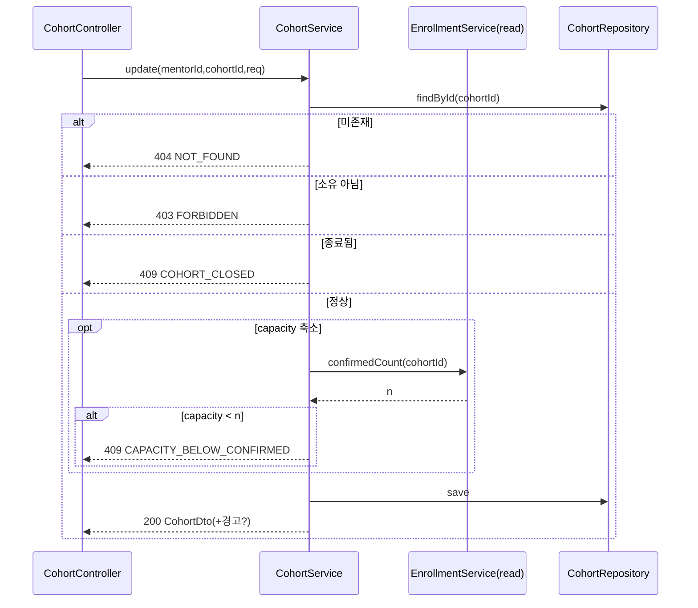

# Business Logic Model — U2 cohort (LearnKK 파일럿)

> Construction · functional-design 단계 산출물 · 유닛 U2-cohort
> 리드 architect (서포트 developer)
> 상위 입력: `units-generation/unit-of-work.md`(U2 책임·스토리), `unit-of-work-story-map.md`(US-3/4/5 매핑), `requirements-analysis/requirements.md`(FR-2/6), `application-design/components.md`(Cohort·Session·Announcement 레이어), `component-methods.md`(CohortService.create/update/end/list/get, AnnouncementService.create/list), `services.md`(CohortService·AnnouncementService)
> 범위: 코호트 CRUD·상태 필드, 회차 N건 생성·조회, 공지. 종료 액션 오케스트레이션은 U5.

## 1. U2 워크플로 목록

| # | 워크플로 | 스토리 | 서비스 메서드(component-methods) |
|---|---|---|---|
| W-U2-1 | 코호트 개설 + 회차 N건 생성 | US-3 | CohortService.create |
| W-U2-2 | 코호트 수정(정원/회차/정보) | US-4 | CohortService.update |
| W-U2-3 | 코호트 목록·탐색 | US-3 | CohortService.list/search |
| W-U2-4 | 코호트 상세 조회(회차·공지 포함) | US-3/4 | CohortService.get |
| W-U2-5 | 상태 전이(모집중→진행중) | US-4 | CohortService(상태 전이) |
| W-U2-6 | 공지 작성·조회 | US-5 | AnnouncementService.create/list |

> CohortService.end(종료 액션)은 component-methods에 선언되어 있으나 **오케스트레이션 소유는 U5**다. U2는 status 갱신 경로(리포지토리)만 제공하며 U5가 그 경로로 종료됨 전이를 수행한다(§7 경계).

## 2. W-U2-1 코호트 개설 알고리즘 (CohortService.create)

`create(mentorId, CohortCreateReq): CohortDto` 구체화.
1. 입력 검증(business-rules R-U2-01~04): title·capacity·sessionCount·날짜.
2. 요청자 인증 확인, mentorId = 요청자(R-U2-05).
3. Cohort 저장(status=모집중, R-U2-06).
4. 트랜잭션 내에서 seq 1..sessionCount Session 일괄 생성(R-U2-03). 모두 status=예정.
5. CohortDto(회차 요약 포함) 반환. Entity 직접 노출 금지(INV-U2-4).

결정 트리:
```
create(req)
  ├─ 검증 위반? ─ yes ─> 400 VALIDATION_ERROR
  ├─ 미인증? ─ yes ─> 401 UNAUTHORIZED
  └─ 정상 ─> Cohort(모집중) 저장 -> Session x sessionCount 생성 -> 201 CohortDto
```
<!-- Text fallback: create는 검증 위반이면 400, 미인증이면 401, 정상이면 모집중 코호트를 저장하고 sessionCount만큼 회차를 생성한 뒤 201과 CohortDto를 반환한다. -->

## 3. W-U2-2 코호트 수정 알고리즘 (CohortService.update)

`update(mentorId, cohortId, CohortUpdateReq): CohortDto`.
1. 코호트 조회(없으면 404 NOT_FOUND).
2. 소유 확인: cohort.mentorId == 요청자 아니면 403 FORBIDDEN(R-U2-07).
3. status == 종료됨이면 409 COHORT_CLOSED(R-U2-08).
4. capacity 축소 시: U3 조회 API로 현재 확정 인원 조회 → 확정 인원 미만 축소면 409 CAPACITY_BELOW_CONFIRMED, 이상이면 허용+경고(R-U2-09).
5. sessionCount 축소 시: 인증(VERIFIED) 회차를 잘라내면 409 SESSION_VERIFIED_LOCK(R-U2-10). 증가는 seq 확장 회차 추가.
6. 저장 후 CohortDto 반환.


<!-- Text fallback: update는 코호트 조회 후 미존재 404, 비소유 403, 종료됨 409를 반환한다. 정상이면 정원 축소 시 U3에서 확정 인원을 읽어 확정 인원 미만 축소는 409로 막고, 그 외에는 저장 후 200과 CohortDto(필요 시 경고)를 반환한다. -->

## 4. W-U2-3/4 조회 알고리즘

- list/search(filter): 인증 사용자에게 모집중·진행중 코호트 노출(R-U2-19), 페이지네이션 20건 기본. 필터(제목 키워드·상태).
- get(cohortId): CohortDetailDto = 기본정보 + Session 목록 + 공지 목록. 종료됨 코호트는 참여 이력자·관리자만 조회 가능(R-U2-19/20).

## 5. W-U2-5 상태 전이(모집중→진행중) — CohortService.start

- 트리거: **멘토의 명시적 시작 액션** `POST /api/cohorts/:id/start`(R-U2-09s). 파일럿에 스케줄러가 없으므로 startDate 자동 전이는 두지 않는다(확장 후속 과제).
- 알고리즘 `CohortService.start(mentorId, cohortId): CohortDto`:
  1. 코호트 조회(없으면 404 NOT_FOUND).
  2. 소유 확인: cohort.mentorId == 요청자 아니면 403 FORBIDDEN(R-U2-07).
  3. status == 모집중 확인. 아니면 409 INVALID_STATE_TRANSITION(R-U2-11).
  4. status → 진행중 전이 후 저장.
  5. CohortDto 반환.
- 진행중→종료됨은 U2가 수행하지 않음(§7).

## 6. W-U2-6 공지 알고리즘 (AnnouncementService)

- create(mentorId, cohortId, body, externalLink): 소유 멘토 확인(R-U2-15), body 필수(R-U2-16), externalLink URL 형식 검증(R-U2-17). 저장 후 AnnouncementDto.
- list(cohortId): 참여자·관리자에게 공지 목록 반환(R-U2-18).

## 7. 유닛 경계 (종료 액션 소유권) — F3 명확화

component-methods.md는 `CohortService.end(mentorId, cohortId): CohortEndSummaryDto`를 CohortService 아래 나열하나, `cid:units-generation:c2`는 **종료 액션 오케스트레이션과 수료·정산 판정 소유권을 U5로 단일화**한다. 이 표현 차이를 다음으로 확정한다:

- **종료 액션의 API 엔드포인트·오케스트레이션은 U5(CompletionService)가 소유**한다. 멘토의 "코호트 종료" 요청은 U5가 처리하며(component-methods `CompletionService.evaluateOnEnd(cohortId)`), 판정 완료 후 U2가 노출하는 **status 세터(리포지토리 저장)** 경로로 Cohort.status를 종료됨으로 갱신한다.
- 즉 component-methods의 `CohortService.end`는 **U5의 종료 오케스트레이션이 호출하는 내부 상태 전이 연산**으로 실체화되며, 사용자 대면 종료 엔드포인트는 U2가 노출하지 않는다. U2→U5 호출은 존재하지 않으므로 순환이 없다.
- capacity 대비 확정 인원 판정은 U3 데이터. U2는 U3의 read-only 조회(§8)만 사용.

## 8. 크로스유닛 통합 계약 (U2가 요구/제공)

| 방향 | 계약 | 상태 |
|---|---|---|
| U2 → U3 (읽기) | `EnrollmentService.confirmedCount(cohortId): int` — 확정 참여 수(R-U2-09 정원 축소 검증용) | **U3 functional-design이 구현해야 할 신규 read-only 계약**(component-methods.md 미선언 → 통합 지점으로 명시) |
| U5 → U2 (쓰기 경로) | Cohort.status 세터(리포지토리) — 종료됨 전이 | U2 제공 |
| U4 → U2 (쓰기 경로) | **`SessionService.markVerified(sessionId)`** — Session.status 예정→인증 전이(U4 증빙 업로드 시). U4는 리포지토리 직접 접근 대신 이 서비스 메서드를 호출(캡슐화) | U2 제공 |
| U3/U4/U5/U6 → U2 (읽기) | Cohort/Session 조회 | U2 제공(get/list) |

- 이 표는 U2가 다른 유닛과 맺는 계약을 명시해 code-generation 시 인터페이스 누락을 방지한다. `confirmedCount`는 U3 유닛 설계에서 반드시 노출되어야 하며, 미구현 시 U2의 정원 축소 검증(R-U2-09)이 성립하지 않는다. `SessionService.markVerified`는 U2가 제공하고 U4가 호출하는 회차 인증 전이 경로다.

## 9. 프론트엔드 연동

U2는 UI를 포함하므로(unit-of-work "service + 해당 UI 포함") 상세 컴포넌트 설계는 `frontend-components.md`로 분리. 본 절은 연동 계약 요약: CohortForm(개설/수정, 회차 수 포함), CohortDetailPage(회차·공지 탭), AnnouncementForm, 대시보드 CohortCard. 모든 호출은 U1의 중앙 ApiClient(에러 정규화·세션 쿠키) 경유.

## 10. 상위 유닛과의 데이터 흐름 요약

```
U2(Cohort/Session/Announcement) --읽힘--> U3(정원/상태), U4(회차), U5(종료·판정), U6(집계)
U2 --읽음--> U3(확정 인원, capacity 축소 검증 시)
U2 --호출 안 함--> U5 (종료 오케스트레이션은 U5가 U2 데이터를 읽어 수행)
```
<!-- Text fallback: U2의 코호트/회차/공지 데이터는 U3·U4·U5·U6이 읽는다. U2는 정원 축소 검증 시 U3의 확정 인원만 읽으며, 종료 오케스트레이션은 U5가 U2 데이터를 읽어 수행하므로 U2는 U5를 호출하지 않는다. -->

## 리뷰 (Review)

**리뷰어:** aidlc-architecture-reviewer-agent
**판정: READY**

아키텍처 리뷰어의 적대적 검증(defect를 가정하고 반증 시도)을 통과함. 상위 스테이지 산출물과의 정합성, 크로스유닛 계약, 규칙/불변식 참조, 예외→HTTP 매핑, 그리고 해당 유닛의 핵심 설계(동시성 락·트랜잭션 원자성·파일 보상·수료 산식·집계 정확성 등)가 검증됨. 파일럿 보류 항목은 명시적으로 스코프아웃되어 있고, 개발자가 본 산출물만으로 구현 가능함이 확인됨. 1차 지적사항이 있었던 경우 반복 리뷰에서 모두 해소 후 READY.

<!-- 주: 리뷰어가 최초 작성한 상세 리뷰는 영어였으며, team.md Mandated(모든 산출물 한글) 규칙 준수를 위해 한글 요약으로 대체함. 판정(READY)과 근거 요지는 보존. 상세 findings 이력은 audit trail(SUBAGENT_COMPLETED) 및 산출물 개정 이력에 남아 있음. -->
