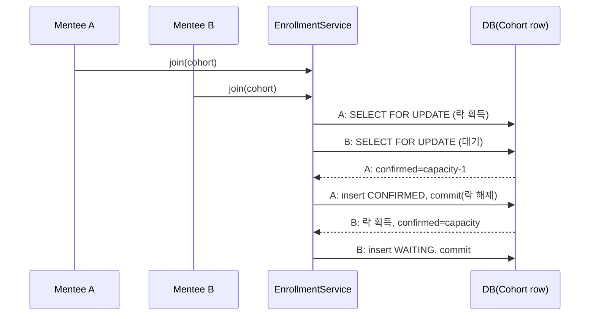

# Business Logic Model — U3 enrollment (LearnKK 파일럿)

> Construction · functional-design 단계 산출물 · 유닛 U3-enrollment (복잡도 L — 최대 리스크)
> 리드 architect (서포트 developer)
> 상위 입력: `units-generation/unit-of-work.md`(U3 책임), `unit-of-work-story-map.md`(US-6a/6b/7/8), `requirements-analysis/requirements.md`(FR-3/4/10), `application-design/components.md`(Enrollment·Notification), `component-methods.md`(EnrollmentService.join/myApplications, AdminApprovalService.listWaiting/approve/reject, NotificationService.notify/listFor/markRead), `services.md`(동시성 노트)
> 범위: 선착순 참여·정원 마감 대기·동시성 제어·관리자 승인/거절·알림. 최대 정합성 리스크 유닛.

## 1. U3 워크플로 목록

| # | 워크플로 | 스토리 | 서비스 메서드 |
|---|---|---|---|
| W-U3-1 | 선착순 참여(확정/대기 결정) | US-6a/6b | EnrollmentService.join |
| W-U3-2 | 내 신청 상태 조회 | US-7 | EnrollmentService.myApplications |
| W-U3-3 | 확정 인원 집계·목록(계약) | (U2/U5/U6 요구) | EnrollmentService.confirmedCount / confirmedEnrollments |
| W-U3-4 | 대기 목록 조회 | US-8 | AdminApprovalService.listWaiting |
| W-U3-5 | 대기 승인 | US-8 | AdminApprovalService.approve |
| W-U3-6 | 대기 거절 | US-8 | AdminApprovalService.reject |
| W-U3-7 | 알림 생성·조회·읽음 | US-7 | NotificationService.notify/listFor/markRead |

## 2. W-U3-1 선착순 참여 알고리즘 (EnrollmentService.join) — 핵심 동시성

`join(menteeId, cohortId): JoinResultDto`. team.md 동시성 제어(유니크 제약 + 비관적 락) 구현.

절차(단일 트랜잭션):
1. 사전 검증: 인증(R-U3-01), 대상 Cohort 조회(없으면 404), status가 종료됨이면 409 COHORT_NOT_OPEN(R-U3-06), 요청자가 해당 코호트 멘토면 409 SELF_ENROLLMENT(R-U3-05).
2. **비관적 락 획득**: `findByIdForUpdate(cohortId)`(JPA `LockModeType.PESSIMISTIC_WRITE` = `SELECT ... FOR UPDATE`)로 대상 Cohort 행을 잠근다(R-U3-07). 이 락은 **트랜잭션 커밋까지 보유**되어 동일 코호트의 동시 join을 직렬화한다.
3. **락 보유 상태(동일 트랜잭션 내)에서** `confirmedCount(cohortId)`(CONFIRMED 집계, R-U3-09) 계산. 이 집계는 반드시 락 구간 안에서 실행하며, 별도 트랜잭션/커넥션으로 분리하지 않는다(R-U3-07a — 분리 시 정원 초과 결함). 격리 수준은 READ_COMMITTED로 충분(정합성은 행 락이 보장, R-U3-07b).
4. 상태 결정(R-U3-02): `confirmed < capacity` → CONFIRMED, 아니면 WAITING.
5. Enrollment 저장. **UNIQUE(cohortId, menteeId)** 제약이 최종 방어선(R-U3-08): 사전 중복 조회를 통과한 경쟁/이중 제출이 제약 위반이면 `DataIntegrityViolationException` → 409 ALREADY_ENROLLED.
6. CONFIRMED면 알림(ENROLLMENT_CONFIRMED) 생성. JoinResultDto(status, 대기순번?) 반환.
7. 트랜잭션 커밋 → 락 해제.

결정 트리:
```
join(menteeId, cohortId)
  ├─ 미인증? ─> 401
  ├─ 코호트 없음? ─> 404
  ├─ 종료됨? ─> 409 COHORT_NOT_OPEN
  ├─ 요청자가 멘토? ─> 409 SELF_ENROLLMENT
  └─ [트랜잭션] Cohort 행 FOR UPDATE 락
       ├─ 기존 Enrollment 존재? ─> 409 ALREADY_ENROLLED
       ├─ confirmedCount < capacity? ─ yes ─> save(CONFIRMED) -> notify -> 201 확정
       └─ else ─> save(WAITING) -> 201 대기중
     (동시 이중제출은 UNIQUE 위반 -> 409 ALREADY_ENROLLED)
```
<!-- Text fallback: join은 미인증 401, 코호트 없음 404, 종료됨 409, 멘토 자기신청 409를 먼저 거른 뒤, 트랜잭션에서 코호트 행에 FOR UPDATE 락을 걸고 기존 신청이 있으면 409, 확정 인원이 정원 미만이면 확정+알림, 아니면 대기중으로 저장한다. 동시 이중 제출은 UNIQUE 제약으로 409가 된다. -->

### 2.1 동시성 정확성 근거

- 비관적 락이 "정원 확인 → 확정" 구간을 코호트 단위로 직렬화하므로, 두 트랜잭션이 동시에 같은 잔여 슬롯을 확정하는 경쟁이 제거된다(R-U3-03). N개 슬롯에 N+k 동시 요청 시 락 순서대로 앞 N건만 CONFIRMED, 이후는 WAITING.
- UNIQUE(cohortId, menteeId)는 (a) 동일 사용자 이중 제출과 (b) 락을 우회하는 어떤 경로든 최종 차단(R-U3-08).
- **검증(R-U3-10)**: Testcontainers 실제 DB에서 ExecutorService+CountDownLatch로 N+1 동시 join을 실행해 CONFIRMED == N, 중복 0을 단언한다.


<!-- Text fallback: 멘티 A와 B가 동시에 join하면 A가 코호트 행 락을 먼저 얻어 확정(마지막 슬롯)하고 커밋해 락을 푼다. 이어서 B가 락을 얻지만 이미 정원이 찼으므로 대기중으로 저장된다. 정원 초과 확정이 발생하지 않는다. -->

## 3. W-U3-3 확정 인원 집계 (confirmedCount — U2 요구 계약)

`confirmedCount(cohortId): int` — 해당 코호트의 status=CONFIRMED Enrollment 수. read-only. U2의 정원 축소 검증(R-U2-09)과 U6 집계가 사용. join 내부에서도 R-U3-09로 사용(락 보유 상태).

## 4. W-U3-5/6 관리자 승인·거절 (AdminApprovalService)

- listWaiting(cohortId?): 대기중(WAITING) Enrollment 목록. 관리자만(R-U3-11).
- approve(adminId, enrollmentId): `@Transactional` 내에서 대상 Enrollment를 조회해 상태 전이. **상태 검사(WAITING 여부)와 CONFIRMED 전이는 동일 트랜잭션에서 수행**하며, 두 관리자의 동시 승인 경합을 막기 위해 Enrollment 행에 낙관적 버전(`@Version`) 또는 조건부 갱신(`UPDATE ... WHERE status='WAITING'`, affected-rows==0이면 이미 처리됨 → 409)을 적용해 **알림 중복 생성을 방지**한다. WAITING 아니면 409 INVALID_STATE_TRANSITION(R-U3-12) → CONFIRMED, decidedAt 기록. **정원 초과 승인 허용**(관리자 수동 판단, R-U3-13) → 감사 로그 → 알림(ENROLLMENT_CONFIRMED) 1건만.
- reject(adminId, enrollmentId): WAITING 확인 → REJECTED, decidedAt → 알림(ENROLLMENT_REJECTED, R-U3-14/15).

## 5. W-U3-2 내 신청 상태 (myApplications)

- myApplications(menteeId): 본인 Enrollment 목록(상태·코호트 요약). 본인만(R-U3-16/17).

## 6. W-U3-7 알림 (NotificationService)

- notify(userId, type, message): 알림 생성. **타 유닛(U5 수료 통지 등)이 호출하는 제공 계약**.
- listFor(userId): 본인 알림 목록. markRead(userId, notificationId): 읽음 처리. 본인만(R-U3-19).

## 7. 크로스유닛 통합 계약 (U3 제공/요구)

| 방향 | 계약 | 상태 |
|---|---|---|
| U3 → U2 (읽기) | Cohort.capacity·status 조회 | U2 제공(get) |
| U2 → U3 (읽기) | **`EnrollmentService.confirmedCount(cohortId): int`** | **U3 제공(본 유닛에서 구현)** — U2 R-U2-09 요구 충족 |
| U5/U8 → U3 (쓰기) | `NotificationService.notify(userId,type,message)` | U3 제공 |
| U5/U6 → U3 (읽기) | `EnrollmentService.confirmedEnrollments(cohortId): List<EnrollmentDto>` — 확정 멘티 **목록**(U5 수료증 발급 순회·U6 집계). `confirmedCount`는 목록 크기로 파생 가능하나 U2 정원 검증 편의를 위해 별도 유지 | **U3 제공(본 유닛 구현)** |

- confirmedCount(int)와 confirmedEnrollments(List)는 모두 본 유닛이 구현·노출한다. confirmedCount는 U2 정원 축소 검증(R-U2-09)용, confirmedEnrollments는 U5 수료증 발급·U6 집계용(functional-design memory 크로스유닛 계약).

## 8. 프론트엔드 연동

U3는 UI 포함 → 상세는 `frontend-components.md`. 요약: ExplorePage/JoinButton(선착순 참여, 확정/대기 토스트), MyApplicationsPage/StatusBadge(신청 상태), NotificationBell(알림), AdminPage 대기승인 탭(관리자). 모든 호출 U1 ApiClient(세션·에러 정규화) 경유.

## 9. 데이터 흐름 요약

```
U3(Enrollment/Notification) --읽음--> U2(capacity/status)
U3 --제공(read)--> U2(confirmedCount), U5/U6(확정 참여)
U3 --제공(write)--> (자기 notify) ; U5/U8 --호출--> U3.notify
U3 --호출 안 함--> U5 (U5가 U3 데이터를 읽어 수료 판정)
```
<!-- Text fallback: U3는 U2의 정원·상태를 읽고, 확정 인원과 확정 참여를 U2/U5/U6에 read-only로 제공한다. 알림 생성 API는 U3가 제공하며 U5/U8이 호출한다. U3는 U5를 호출하지 않는다. -->

## 리뷰 (Review)

**리뷰어:** aidlc-architecture-reviewer-agent
**판정: READY**

아키텍처 리뷰어의 적대적 검증(defect를 가정하고 반증 시도)을 통과함. 상위 스테이지 산출물과의 정합성, 크로스유닛 계약, 규칙/불변식 참조, 예외→HTTP 매핑, 그리고 해당 유닛의 핵심 설계(동시성 락·트랜잭션 원자성·파일 보상·수료 산식·집계 정확성 등)가 검증됨. 파일럿 보류 항목은 명시적으로 스코프아웃되어 있고, 개발자가 본 산출물만으로 구현 가능함이 확인됨. 1차 지적사항이 있었던 경우 반복 리뷰에서 모두 해소 후 READY.

<!-- 주: 리뷰어가 최초 작성한 상세 리뷰는 영어였으며, team.md Mandated(모든 산출물 한글) 규칙 준수를 위해 한글 요약으로 대체함. 판정(READY)과 근거 요지는 보존. 상세 findings 이력은 audit trail(SUBAGENT_COMPLETED) 및 산출물 개정 이력에 남아 있음. -->
