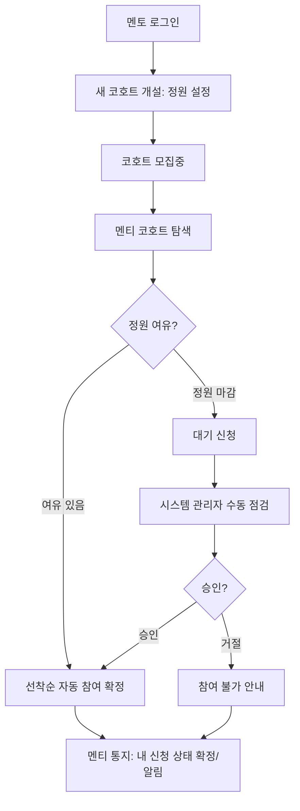
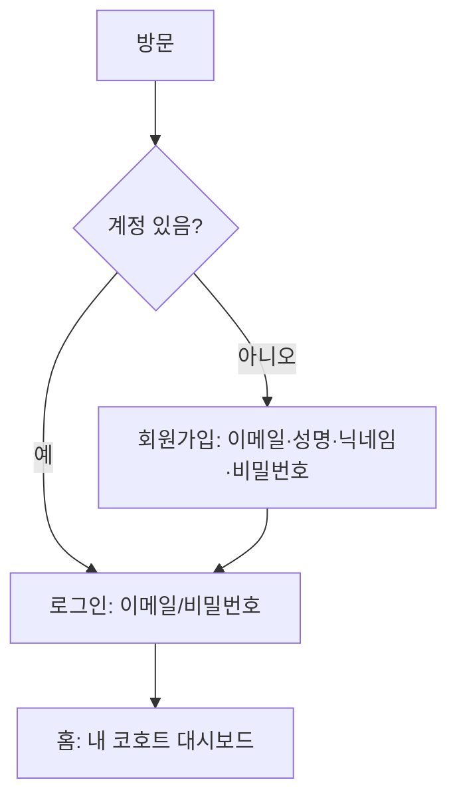
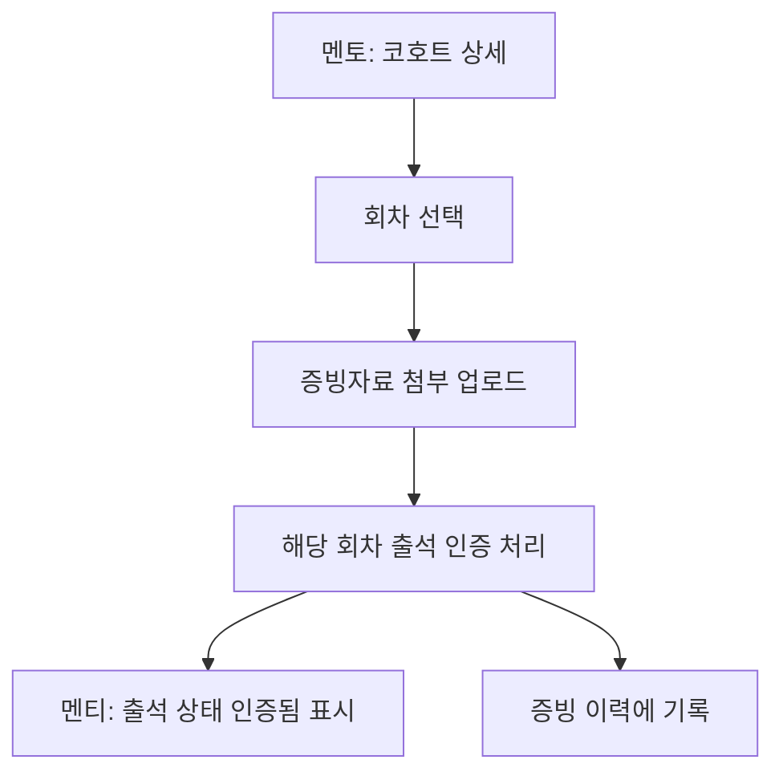
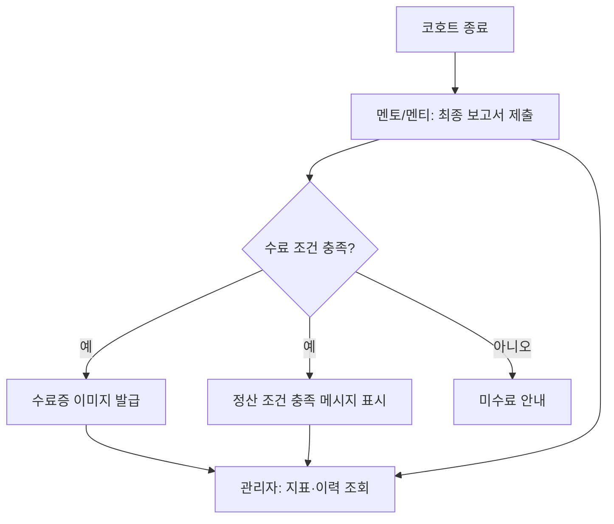

# User Flows — LearnKK (사내 멘토링 통합 플랫폼 파일럿)

> Ideation · rough-mockups 단계 산출물 · 리드 design (서포트: product)
> 상위 입력: `scope-definition/scope-document.md`, `scope-definition/intent-backlog.md`
> 근거: rough-mockups-questions.md · scope-document의 역할·첫 슬라이스
> 각 다이어그램은 Mermaid + 텍스트 대체 설명을 함께 제공.

## 흐름 1 — 첫 슬라이스: 코호트 개설 → 선착순 참여 → (마감 시 승인)

텍스트 대체: 멘토가 로그인해 정원을 설정한 코호트를 개설하면 모집이 시작된다. 멘티가 코호트를 탐색해 참여를 누르면, 정원에 여유가 있으면 즉시 참여가 확정된다. 정원이 마감된 경우 대기 신청이 되고, 시스템 관리자가 수동 점검 후 승인하면 참여 확정, 거절하면 참여 불가 안내를 받는다. 승인/거절 결과는 멘티의 "내 신청 상태"와 알림에 통지된다(화면 3b).

## 흐름 2 — 회원가입 / 로그인

텍스트 대체: 방문자는 계정이 있으면 이메일·비밀번호로 로그인하고, 없으면 이메일·성명·닉네임·비밀번호로 회원가입한다(그 외 정보 미수집). 로그인 후 첫 화면은 내 코호트 대시보드다.

## 흐름 3 — 진도·출석(증빙 인증)

텍스트 대체: 멘토가 코호트 상세에서 회차를 선택해 증빙자료를 업로드하면 그 회차의 출석이 인증 처리된다. 멘티는 출석이 인증됨으로 표시되고, 업로드된 증빙은 이력에 기록되어 관리자가 조회할 수 있다.

## 흐름 4 — 수료 및 최종 보고서

텍스트 대체: 코호트가 종료되면 최종 보고서를 제출한다. 수료 조건을 충족하면 단순 수료증 이미지가 발급되고 "정산 조건 충족" 메시지가 표시된다. 충족하지 못하면 미수료 안내를 받는다. 관리자는 완주/출석/수료율 등 지표와 증빙·보고서 이력을 조회한다.

## 흐름 개요 (역할별 요약)

- **멘토**: 코호트 개설(정원) → 공지 → 출석 증빙 업로드 → 최종 보고서 제출
- **멘티**: 탐색 → 선착순 참여 → 진도·출석 확인 → 최종 보고서 → 수료증 수령
- **시스템 관리자**: 정원 마감 대기 승인 → 운영 지표·증빙·보고서 이력 조회
