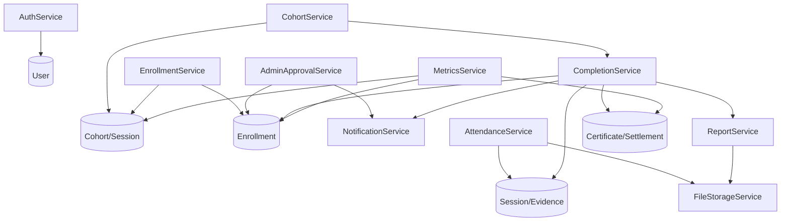
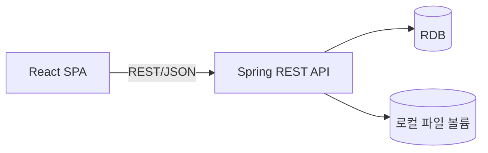

# Component Dependency — LearnKK (파일럿)

> Inception · application-design 단계 산출물 · 컴포넌트/서비스 의존 관계
> 상위 입력: `services.md`, `components.md` · Mermaid + 텍스트 대체

## 백엔드 서비스 의존 그래프

텍스트 대체: AuthService는 User를 다룬다. CohortService는 Cohort/Session을 생성·관리하고 종료 시 CompletionService를 호출한다. EnrollmentService는 Cohort 정원과 Enrollment(비관적 락)로 참여/대기를 처리한다. AdminApprovalService는 Enrollment 상태를 바꾸고 NotificationService로 알림을 생성한다. AttendanceService·ReportService는 FileStorageService로 파일을 저장한다. CompletionService는 Session/Enrollment/Report를 읽어 수료·정산을 판정하고 Certificate/Settlement 생성 및 알림을 발생시킨다. MetricsService는 Cohort/Enrollment/Certificate를 집계한다.

## 프론트 ↔ 백엔드

텍스트 대체: React SPA가 REST/JSON으로 Spring API를 호출하고, API는 관계형 DB와 로컬 파일 볼륨을 사용한다. 저장소는 FE/BE 분리(team-practices), API 계약은 springdoc-openapi로 문서화.

## 순환 의존 점검

- CohortService → CompletionService는 단방향(종료 트리거). CompletionService는 CohortService를 호출하지 않음(순환 없음).
- NotificationService는 리프(다른 서비스를 호출하지 않음).
